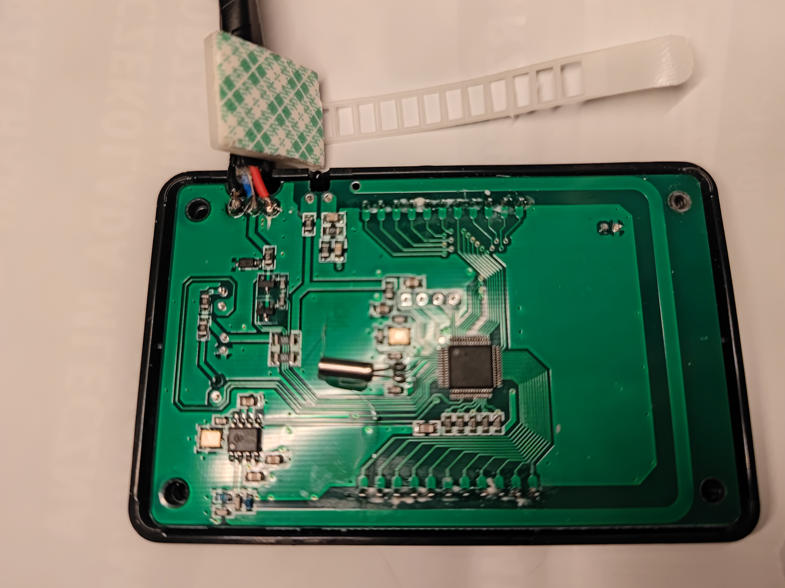

# **ESPHome-Chinbasto**

A custom ESPHome component for controlling Chinese Webasto heaters using ESP32. This project adds **on/off control** via soldering, as the serial communication is currently read-only. It is based on the work of [timmchugh11](https://github.com/timmchugh11/Chinese-Diesel-Heater---ESPHome) and builds on the reverse engineering efforts of **Ray Jones**.

[](LICENSE)

---

## **Table of Contents**
1. [Introduction](#introduction)
2. [Features](#features) 
3. [Roadmap - nice to have in future](#roadmap---nice-to-have-in-future)
4. [Hardware Requirements](#hardware-requirements)
5. [Software Installation on ESP32](#software-installation-on-esp32)
6. [Configuration](#configuration)
7. [Usage](#usage)
8. [Hardware modification - On/Off Switch control](#hardware-modification---onoff-switch-control)
9. [Documentation](#documentation)
10. [Credits](#credits)
11. [License](#license)

---

## **Introduction**
This project enables control of Chinese Webasto heaters using ESP32 and ESPHome. It extends the functionality of the original work by [timmchugh11](https://github.com/timmchugh11/Chinese-Diesel-Heater---ESPHome) and incorporates insights from **Ray Jones**' reverse engineering of the serial communication protocol.

The current implementation focuses on **read-only serial communication** and adds **on/off control** via GPIO pins, requiring soldering to the heater's control board.

---

## **Features**
- **Read-only serial communication**: Monitor heater status, temperature, fan speed, and error codes.
- **On/Off control**: Turn the heater on/off (currently hardware modification required, see below)
- **Smart On/Off**: Automatically handles 1-second or 3-second button presses based on the heater's current state.
- **MQTT integration**: Publish heater data to an MQTT broker.
- **OTA updates**: Update the firmware over-the-air (ESPHome feature)
- **Web interface**: Access a local web interface for monitoring and control (ESPHome feature):


## **Roadmap - nice to have in future**
- Getting control with on/off switch without soldering.

  [This project](https://github.com/wshelley/Chinese-Diesel-Heater-Advanaced-Thermostat-Temperature-Controller/blob/master/Heater-Temp-Module.ino)
   seems to have it worked out! 

- refactoring code to proper ESPHome component
---

## **Hardware Requirements**
- **ESP32 development board** (e.g., ESP32 DevKit).
- **Chinese Webasto heater** with a compatible control board: "3-wire": the 3 wires: red,blue and black connect to webasto controller via "triangle" connector
- **Soldering tools**: To connect GPIO pins for on/off control.
- **1k resistors**: For connecting GPIO pins to the heater's control board.
- **Wiring**: Connect the ESP32 to the heater's serial interface and GPIO pins.

### **Compatibility**

It should work with all classic Chinese diesel heaters that have 3 wire control system. Not tested with ones having bluetooth.

Note: I have bought heater with black controller. I had replaced it with blue controller which has a much better remote with tiny OLED display. 

For the mod I have played with soldering the black one. Success!


---

## **Software Installation on ESP32**
1. **Clone the repository**:
   ```bash
   git clone https://github.com/pavelw/esphome-chinbasto.git
   cd esphome-chinbasto
   ```

2. **Install ESPHome**:
   - Follow the [ESPHome installation guide](https://esphome.io/guides/getting_started_command_line.html) to set up ESPHome on your system.

3. **Set up `secrets.yaml`**:
   - Copy `secrets.yaml.template` to `secrets.yaml` and fill in your Wi-Fi credentials, MQTT broker details, and OTA password.

4. **Compile and upload**:
   - Compile the firmware and upload it to your ESP32:
     ```bash
     esphome run esp32-webasto36.yaml
     ```

---


## **Hardware modification - On/Off Switch control**
To add **on/off control** to your heater, you need to solder transistor to the board. This is temporary workking solution until someone manages to control via UART, see [Roadmap - nice to have in future](#roadmap---nice-to-have-in-future).

Parts required, besides ESP32:
- 1 transistor, type 2N2222
- 1 resistor, 1K Ohm

### **Transistor Pin Identification**
When soldering to the control board, you may need to identify the **emitter, base, and collector** of a transistor. A helpful video tutorial can be found here:  
[How to Identify Emitter, Base, and Collector on a Transistor](https://www.youtube.com/watch?v=W5yfAZoE5sY)

### Power control modification

1. Front cover disassembly  


2. Backplate overview 
 
- Blue wire: serial connection wire
- Red wire: 5V DC, OPTIONAL: connect ESP32 to its +5V here to power ESP32 off the webasto.
- Black wire: Ground. connect this to GND of ESP32 (REQUIRED otherwise reading serial connection will not work)


3. Close-up of backplate  


4. Transistor - before insulation

- check using multimeter which pins of button are going to the ground. Use "contuinity check" with one probe connected to negative wire (see pic 2).
For my controller, the negative ones were ones on left side, both on top on bottom of the power button.
- keep transistor fixed, I have used hot glue
- transistors' EMITTER pin connect to GROUND of the switch. On the picture its the bottom one, I have made its long feet turn almost 90 degrees up to the button solder point.
- transistor's COLLECTOR pin connect to other side of the switch. On the picture it is the top most one.
- transistor's BASE pin (middle one) goes through 1K resistor, then to ESP32 pin (brown cable on the picture). Make sure it does not touch the other pins - insulate it after soldering!

5. Transistor after insulation of the BASE pin

Make sure that it is possible to close the case of controller.
I have routed the wire to top, exiting together with three standard.

6. Completed installation  


7. Extra: When ESP32 is powered from red line, make sure you add some fuse.  


## **Configuration**
### **YAML Configuration**
The main configuration file is `esp32-webasto36.yaml`. Key sections include:
- **Wi-Fi**: Configure your Wi-Fi network.
- **MQTT**: Set up MQTT integration for remote monitoring.
- **UART**: Configure serial communication with the heater.
- **GPIO**: Define pins for on/off control.

### **Custom Component**
The custom component (`heater.h`) handles serial communication and GPIO control. Work done by [timmchugh11](https://github.com/timmchugh11/Chinese-Diesel-Heater---ESPHome).
It is based on the reverse-engineered protocol documented by **Ray Jones**. 

---

## **Usage**
1. **Monitor heater status**:
   - Use the ESPHome web interface or MQTT to monitor the heater's status, temperature, fan speed, and error codes.

2. **Control the heater**:
   - Use the web interface or MQTT commands to turn the heater on/off.
   - The **Smart On/Off** feature automatically handles 1-second or 3-second button presses based on the heater's current state.

3. **Debugging**:
   - Change Logger level from INFO to Debug to debug UART serial communication.

---

## **Documentation**

### **Smart On/Off Control**
The **Smart On/Off** feature in the YAML configuration automatically handles the required button press duration:
- **1-second press**: Turns the heater on.
- **3-second press**: Turns the heater off.

This is exposed in ESPHome Web Panel and as MQTT command.


### **Serial Protocol**
The serial communication protocol for Chinese Webasto heaters was reverse-engineered by **Ray Jones**. Detailed documentation can be found in his work:
- [V9 - Hacking the Chinese Diesel Heater Communications Protocol](https://gitlab.com/mrjones.id.au/bluetoothheater/-/blob/master/Documentation/V9%20-%20Hacking%20the%20Chinese%20Diesel%20Heater%20Communications%20Protocol.pdf?ref_type=heads)

### **ESPHome Configuration**
- Refer to the [ESPHome documentation](https://esphome.io/) for details on configuring ESPHome components.

---

## **Credits**
This project builds on the work of:
- **[timmchugh11](https://github.com/timmchugh11/Chinese-Diesel-Heater---ESPHome)**: Original ESPHome integration for Chinese diesel heaters.
- **[Ray Jones](https://gitlab.com/mrjones.id.au/bluetoothheater/-/blob/master/Documentation/V9%20-%20Hacking%20the%20Chinese%20Diesel%20Heater%20Communications%20Protocol.pdf?ref_type=heads)**: Reverse engineering of the serial communication protocol.
[Ray Jones - Hacking the Chinese Diesel Heater Communications Protocol V9.pdf](resources/Ray%20Jones%20-%20Hacking%20the%20Chinese%20Diesel%20Heater%20Communications%20Protocol%20V9.pdf) - from
[gitlab.com/mrjones.id.au/bluetoothheater](https://gitlab.com/mrjones.id.au/bluetoothheater/-/blob/master/Documentation/Hacking%20the%20Chinese%20Diesel%20Heater%20Communications%20Protocol%20V9.docx?ref_type=heads)

---

## **License**
This project is licensed under the **MIT License**. See the [LICENSE](LICENSE) file for details.
